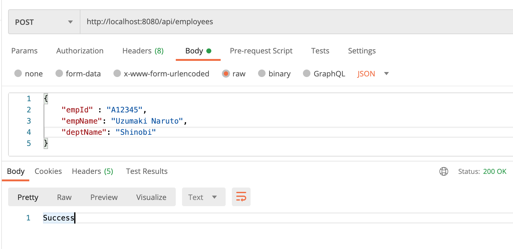
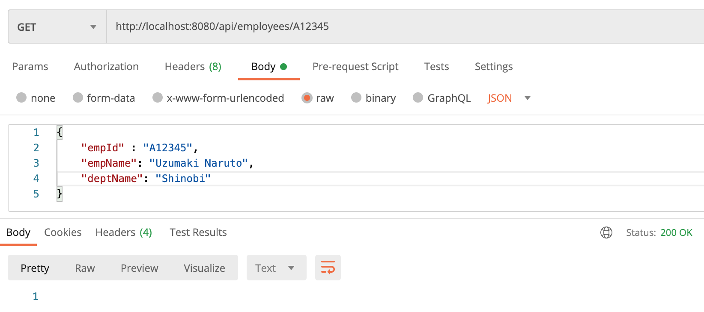

# springboot-aop

## Overview

Aspect Oriented Programming helps us to reduce some boilerplate code,isolate business logic and keep code readable. To
execute a particular task before or after a method, we can use AOP. Underneath Spring uses proxy call to create a
wrapper around the actual method execution class. There are some key terms we need to know about AOP.

|#|Method|Details|
| --- | --- | --- |
|1|JointPoint|Actual execution method whose behavior is altered.|
|2|PointCut|Predicate used to match the Joint point.|
|3|Advice|Code/Task execute before or after the PointCut call.|
|4|Aspect|Combines both pointcut and advice.|
|5|Weaving|Time when aspect is executed.|

### Things todo list:

1. Clone this repository: `git clone https://github.com/hendisantika/springboot-aop.git`
2. Go inside the folder: `cd springboot-aop`
3. Run the application: `mvn clean spring-boot:run`
4. Open your favorite terminal

Add New Employee



```shell
curl --location --request POST 'http://localhost:8080/api/employees' \
--header 'Content-Type: application/json' \
--data-raw '{
"empId" : "A12345",
"empName": "Uzumaki Naruto",
"deptName": "Shinobi"
}' | jq .
```

Get All Employees



```shell
curl --location --request GET 'http://localhost:8080/api/employees/A12345' \
--header 'Content-Type: application/json' \
--data-raw '{
    "empId" : "A12345",
    "empName": "Uzumaki Naruto",
    "deptName": "Shinobi"
}' | jq .
```